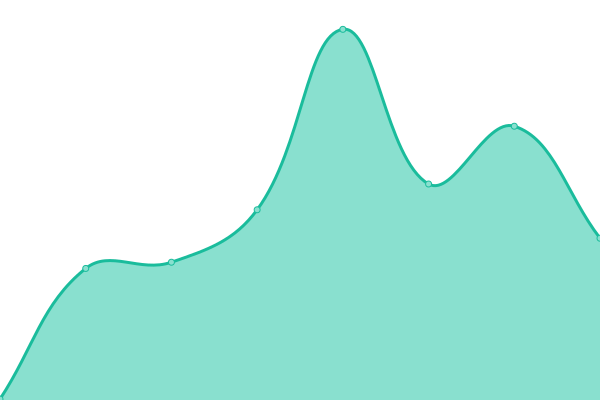
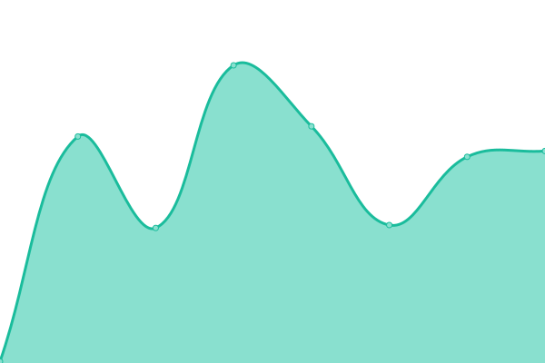

# [📈 Live Status](https://status.smach.us): <!--live status--> **🟥 Complete outage**

This repository contains the open-source uptime monitor and status page for [coder0987](https://status.smach.us), powered by [Upptime](https://github.com/upptime/upptime).

With [Upptime](https://upptime.js.org), you can get your own unlimited and free uptime monitor and status page, powered entirely by a GitHub repository. We use [Issues](https://github.com/coder0987/status/issues) as incident reports, [Actions](https://github.com/coder0987/status/actions) as uptime monitors, and [Pages](https://status.smach.us) for the status page.

<!--start: status pages-->
<!-- This summary is generated by Upptime (https://github.com/upptime/upptime) -->
<!-- Do not edit this manually, your changes will be overwritten -->
<!-- prettier-ignore -->
| URL | Status | History | Response Time | Uptime |
| --- | ------ | ------- | ------------- | ------ |
|  [MachTarok](https://machtarok.com) | 🟥 Down | [mach-tarok.yml](https://github.com/coder0987/status/commits/HEAD/history/mach-tarok.yml) | 

 123ms
     
 | 

<a href="https://status.smach.us/history/mach-tarok">0.00%</a>
    

|  [MachSSO](https://sso.smach.us) | 🟥 Down | [mach-sso.yml](https://github.com/coder0987/status/commits/HEAD/history/mach-sso.yml) | 

 106ms
     
 | 

<a href="https://status.smach.us/history/mach-sso">0.00%</a>
    

|  [SMACH.US](https://smach.us) | 🟥 Down | [smach-us.yml](https://github.com/coder0987/status/commits/HEAD/history/smach-us.yml) | 

 98ms
     
 | 

<a href="https://status.smach.us/history/smach-us">0.00%</a>
    

|  [Samuel Mach](https://samuelmach.com) | 🟥 Down | [samuel-mach.yml](https://github.com/coder0987/status/commits/HEAD/history/samuel-mach.yml) | 

 137ms
     
 | 

<a href="https://status.smach.us/history/samuel-mach">0.00%</a>
    

|  [Scapular Info](https://scapularinfo.com) | 🟥 Down | [scapular-info.yml](https://github.com/coder0987/status/commits/HEAD/history/scapular-info.yml) | 

 152ms
     
 | 

<a href="https://status.smach.us/history/scapular-info">0.00%</a>
    

|  [MachTarok Wiki](https://wiki.machtarok.com) | 🟥 Down | [mach-tarok-wiki.yml](https://github.com/coder0987/status/commits/HEAD/history/mach-tarok-wiki.yml) | 

 125ms
     
 | 

<a href="https://status.smach.us/history/mach-tarok-wiki">0.00%</a>
    

<!--end: status pages-->

[**Visit our status website →**](https://status.smach.us)

## 📄 License

- Powered by: [Upptime](https://github.com/upptime/upptime)
- Code: [MIT](./LICENSE) © [Anand Chowdhary](https://anandchowdhary.com), supported by [Pabio](https://pabio.com)
- Data in the `./history` directory: [Open Database License](https://opendatacommons.org/licenses/odbl/1-0/)
